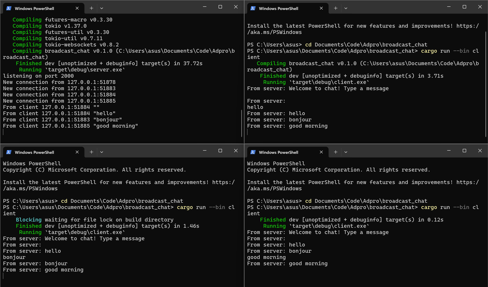

> Fari Hafizh Ramadhan - 2206083691

# Modul 10: Asynchronous Programming

### 2.1 Original code, and how it run

Di gambar yang ditunjukkan, terlihat bahwa saya sedang mencoba menjalankan satu server (di pojok kiri) dan tiga client (di tiga jendela terminal lainnya). Server dijalankan menggunakan perintah cargo run --bin server, sedangkan client menggunakan perintah cargo run --bin client di setiap terminal. Saat server berjalan, kita dapat melihat bahwa ada tiga koneksi dari tiga client yang berbeda port. Ketika saya mengirim pesan dari salah satu client, pesan tersebut akan disiarkan (broadcast) ke semua client lainnya oleh server.

