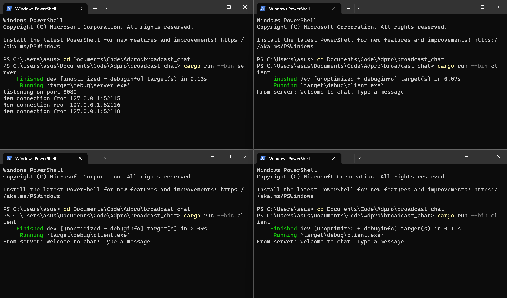
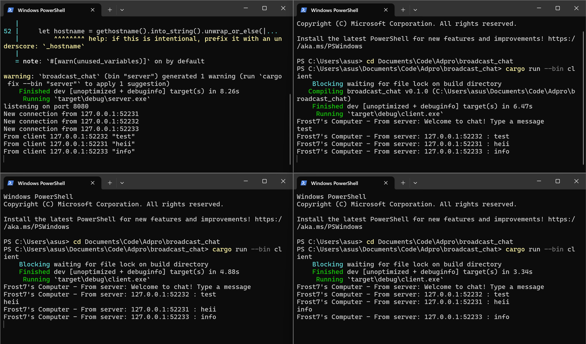

> Fari Hafizh Ramadhan - 2206083691

# Modul 10: Asynchronous Programming

### 2.1 Original code, and how it run

Di gambar yang ditunjukkan, terlihat bahwa saya sedang mencoba menjalankan satu server (di pojok kiri) dan tiga client (di tiga jendela terminal lainnya). Server dijalankan menggunakan perintah cargo run --bin server, sedangkan client menggunakan perintah cargo run --bin client di setiap terminal. Saat server berjalan, kita dapat melihat bahwa ada tiga koneksi dari tiga client yang berbeda port. Ketika saya mengirim pesan dari salah satu client, pesan tersebut akan disiarkan (broadcast) ke semua client lainnya oleh server.

### 2.2 Modifying the websocket port

Setelah saya mengubah port dari 2000 menjadi 8080 di kedua file (client dan server), saya bersyukur bahwa program tetap berjalan dengan lancar. Ini karena keduanya, baik server maupun client, menggunakan port yang sama.

### 2.3: Small changes, add IP and Port

Di gambar yang terlihat, saya mencoba menambahkan informasi sender ke setiap client dengan menyertakan nama hostnya, yaitu komputer saya (Frost7). Saya melakukan ini dengan menggunakan dependency baru bernama gethostname. Setelah menerapkan dependency tersebut, saya memodifikasi perintah print di server dan client untuk menambahkan hostname, sehingga program dapat berjalan sesuai dengan gambar yang ditunjukkan.